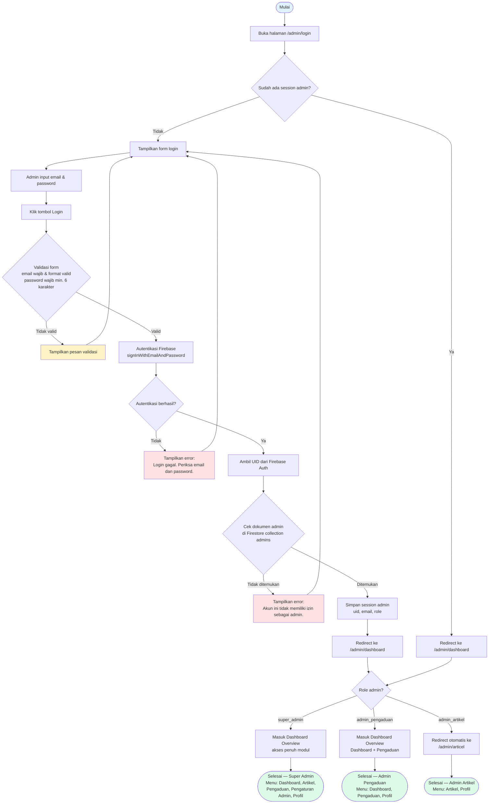
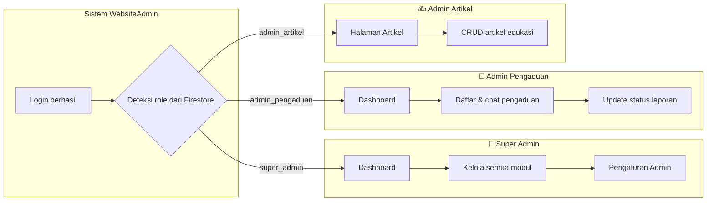

# Activity Diagram — Login Admin (3 Role)

Dokumentasi **Activity Diagram** alur login untuk aplikasi **WebsiteAdmin**, mencakup **Super Admin**, **Admin Pengaduan**, dan **Admin Artikel** berdasarkan implementasi di `AuthController` dan redirect per role.

---

## 1. Diagram Activity Login (Mermaid)

Salin blok kode di bawah ini ke [mermaid.ai](https://mermaid.ai) atau editor yang mendukung Mermaid:

---

## 2. Diagram Activity per Role (Swimlane)

Diagram terpisah yang menekankan **halaman tujuan** setelah login berhasil:

---

## 3. Tabel Langkah Proses Login

| No | Aktivitas | Aktuator | Keterangan |
|----|-----------|----------|------------|
| 1 | Mengakses halaman login | Admin | URL: `/admin/login` |
| 2 | Mengisi email dan password | Admin | Form POST ke `/admin/login` |
| 3 | Validasi input | Sistem | Laravel validation |
| 4 | Autentikasi kredensial | Sistem | Firebase Authentication |
| 5 | Verifikasi izin admin | Sistem | Cek dokumen di Firestore `admins/{uid}` |
| 6 | Menyimpan session | Sistem | `Session::put('admin', [...])` |
| 7 | Mengarahkan halaman awal | Sistem | Berdasarkan role |

---

## 4. Halaman Tujuan Setelah Login

| Role | Nilai `role` di Firestore | Halaman pertama | Menu sidebar yang tersedia |
|------|---------------------------|-----------------|----------------------------|
| **Super Admin** | `super_admin` | `/admin/dashboard` | Dashboard, Artikel, Pengaduan, Pengaturan Admin, Profil |
| **Admin Pengaduan** | `admin_pengaduan` | `/admin/dashboard` | Dashboard, Pengaduan, Profil |
| **Admin Artikel** | `admin_artikel` | `/admin/articel` *(redirect dari dashboard)* | Artikel, Profil |

---

## 5. Cabang Error (Decision Node)

| Kondisi | Pesan / Hasil |
|---------|----------------|
| Email kosong / format tidak valid | Validasi Laravel di form login |
| Password kosong / kurang dari 6 karakter | Validasi Laravel di form login |
| Email/password salah di Firebase | *"Login gagal. Periksa email dan password."* |
| Login Firebase berhasil, tetapi UID tidak ada di collection `admins` | *"Akun ini tidak memiliki izin sebagai admin."* |
| Session sudah aktif saat buka `/admin/login` | Redirect langsung ke dashboard (kemudian dicek role) |

---

## 6. Referensi Kode

| Komponen | File |
|----------|------|
| Form & halaman login | `resources/views/admin/login.blade.php` |
| Proses login & session | `app/Http/Controllers/authcontroller.php` → `login()` |
| Redirect Admin Artikel | `app/Http/Controllers/dashboardcontroller.php` → `index()` |
| Menu berdasarkan role | `resources/views/admin/partials/sidebar.blade.php` |
| Route login | `routes/web.php` |

---

## 7. Catatan UML

- **Initial node**: titik mulai admin membuka halaman login.
- **Activity**: kotak proses (validasi, autentikasi, simpan session).
- **Decision node**: belah berlian `{...}` untuk percabangan ya/tidak.
- **Final node**: titik akhir admin berada di halaman sesuai role.
- Ketiga role **menggunakan alur login yang sama**; perbedaan hanya pada **cabang setelah session tersimpan** (deteksi `role`).
