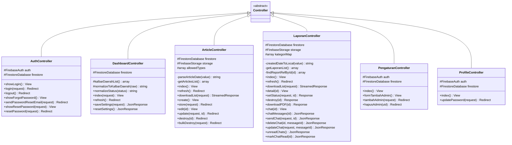
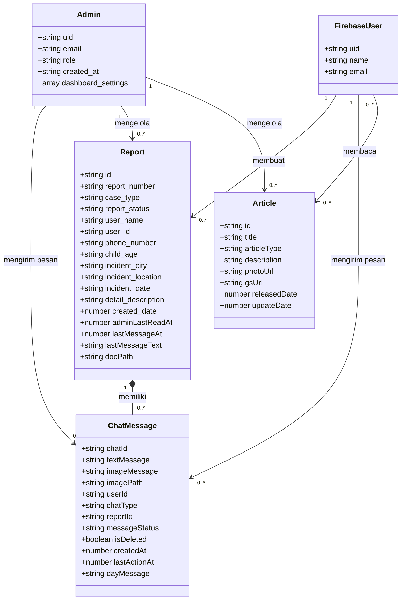
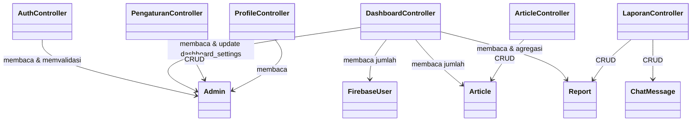
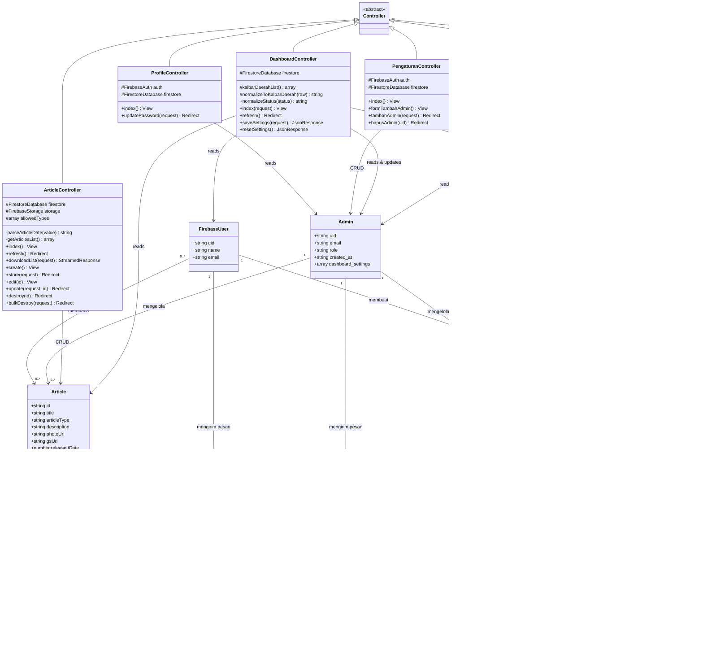

# Class Diagram — WebsiteAdmin

Class diagram lengkap untuk aplikasi **WebsiteAdmin** berbasis Laravel + Firebase.

---

## 1. Class Diagram — Controllers (Inheritance + Atribut + Method)

---

## 2. Class Diagram — Entitas Data (Firestore Collections & Subcollections)

---

## 3. Class Diagram — Relasi Controller ↔ Entitas Data

---

## 4. Class Diagram Lengkap (Gabungan)

---

## Keterangan Simbol

| Simbol | Arti |
|---|---|
| `+` | public |
| `#` | protected |
| `-` | private |
| `$` | static |
| `<|--` | inheritance (pewarisan) |
| `-->` | dependency / association (menggunakan) |
| `*--` | composition (bagian yang tidak bisa berdiri sendiri) |
| `"1" → "0..*"` | multiplicity (1 ke banyak) |

## Ringkasan Relasi Antar Entitas

| Relasi | Tipe | Keterangan |
|---|---|---|
| FirebaseUser → Report | **One to Many** | 1 user bisa membuat banyak laporan |
| Report → ChatMessage | **Composition** | 1 laporan memiliki banyak pesan chat (chat tidak ada tanpa report) |
| Admin → ChatMessage | **One to Many** | Admin bisa mengirim pesan ke banyak chat |
| FirebaseUser → ChatMessage | **One to Many** | User bisa mengirim pesan ke banyak chat |
| Admin → Report | **One to Many (Logis)** | Admin mengelola banyak laporan kasus |
| Admin → Article | **One to Many (Logis)** | Admin mengelola banyak artikel edukasi |
| FirebaseUser → Article | **Many to Many (Logis)** | Banyak user membaca banyak artikel |

## Ringkasan Controller → Entitas

| Controller | Entitas yang diakses | Operasi |
|---|---|---|
| **AuthController** | Admin | Read, Validate login |
| **DashboardController** | FirebaseUser, Article, Report, Admin | Read, Agregasi statistik, Update settings |
| **ArticleController** | Article | Create, Read, Update, Delete |
| **LaporanController** | Report, ChatMessage | Create, Read, Update, Delete |
| **PengaturanController** | Admin | Create, Read, Delete |
| **ProfileController** | Admin | Read |
