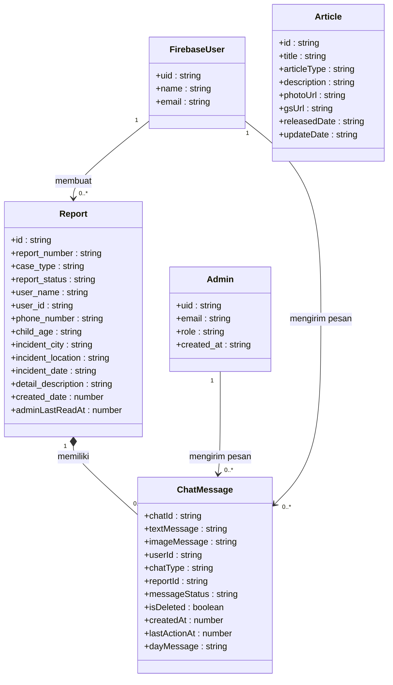
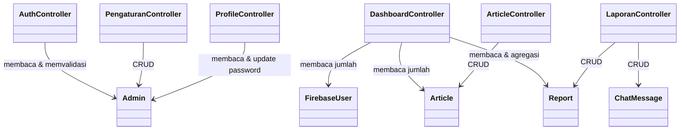
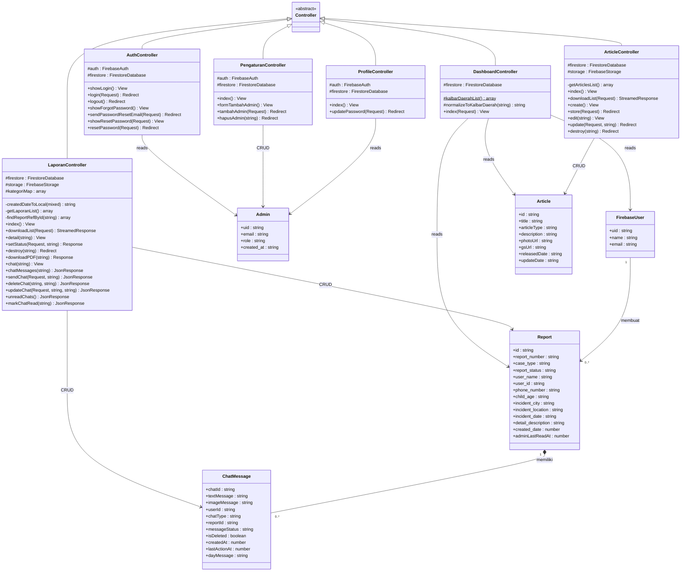

# Class Diagram — WebsiteAdmin

Class diagram lengkap untuk aplikasi **WebsiteAdmin** berbasis Laravel + Firebase.

---

## 1. Class Diagram — Controllers (Inheritance + Atribut + Method)

```mermaid
classDiagram
    direction TB

    class Controller {
        <<abstract>>
    }

    class AuthController {
        #auth : FirebaseAuth
        #firestore : FirestoreDatabase
        +showLogin() View
        +login(Request request) Redirect
        +logout() Redirect
        +showForgotPassword() View
        +sendPasswordResetEmail(Request request) Redirect
        +showResetPassword(Request request) View
        +resetPassword(Request request) Redirect
    }

    class DashboardController {
        #firestore : FirestoreDatabase
        #kalbarDaerahList()$ array
        #normalizeToKalbarDaerah(string raw) string
        +index(Request request) View
    }

    class ArticleController {
        #firestore : FirestoreDatabase
        #storage : FirebaseStorage
        -getArticlesList() array
        +index() View
        +downloadList(Request request) StreamedResponse
        +create() View
        +store(Request request) Redirect
        +edit(string id) View
        +update(Request request, string id) Redirect
        +destroy(string id) Redirect
    }

    class LaporanController {
        #firestore : FirestoreDatabase
        #storage : FirebaseStorage
        #kategoriMap : array
        -createdDateToLocal(mixed value) string
        -getLaporanList() array
        -findReportRefById(string id) array
        +index() View
        +downloadList(Request request) StreamedResponse
        +detail(string id) View
        +setStatus(Request request, string id) Response
        +destroy(string id) Redirect
        +downloadPDF(string id) Response
        +chat(string id) View
        +chatMessages(string id) JsonResponse
        +sendChat(Request request, string id) JsonResponse
        +deleteChat(string id, string messageId) JsonResponse
        +updateChat(Request request, string id, string messageId) JsonResponse
        +unreadChats() JsonResponse
        +markChatRead(string id) JsonResponse
    }

    class PengaturanController {
        #auth : FirebaseAuth
        #firestore : FirestoreDatabase
        +index() View
        +formTambahAdmin() View
        +tambahAdmin(Request request) Redirect
        +hapusAdmin(string uid) Redirect
    }

    class ProfileController {
        #auth : FirebaseAuth
        #firestore : FirestoreDatabase
        +index() View
        +updatePassword(Request request) Redirect
    }

    Controller <|-- AuthController
    Controller <|-- DashboardController
    Controller <|-- ArticleController
    Controller <|-- LaporanController
    Controller <|-- PengaturanController
    Controller <|-- ProfileController
```

---

## 2. Class Diagram — Entitas Data (Firestore Collections)

---

## 3. Class Diagram — Relasi Controller ↔ Entitas Data

---

## 4. Class Diagram Lengkap (Gabungan)

---

## Keterangan Simbol

| Simbol | Arti |
|---|---|
| `+` | public |
| `#` | protected |
| `-` | private |
| `$` | static |
| `<\|--` | inheritance (pewarisan) |
| `-->` | dependency / association (menggunakan) |
| `*--` | composition (bagian yang tidak bisa berdiri sendiri) |
| `"1" → "0..*"` | multiplicity (1 ke banyak) |

## Ringkasan Relasi Antar Entitas

| Relasi | Tipe | Keterangan |
|---|---|---|
| FirebaseUser → Report | **One to Many** | 1 user bisa membuat banyak laporan |
| Report → ChatMessage | **Composition** | 1 laporan memiliki banyak pesan chat (chat tidak ada tanpa report) |
| Admin → ChatMessage | **One to Many** | Admin bisa mengirim pesan ke banyak chat |

## Ringkasan Controller → Entitas

| Controller | Entitas yang diakses | Operasi |
|---|---|---|
| **AuthController** | Admin | Read, Validate login |
| **DashboardController** | FirebaseUser, Article, Report | Read, Agregasi statistik |
| **ArticleController** | Article | Create, Read, Update, Delete |
| **LaporanController** | Report, ChatMessage | Create, Read, Update, Delete |
| **PengaturanController** | Admin | Create, Read, Delete |
| **ProfileController** | Admin | Read, Update password |
