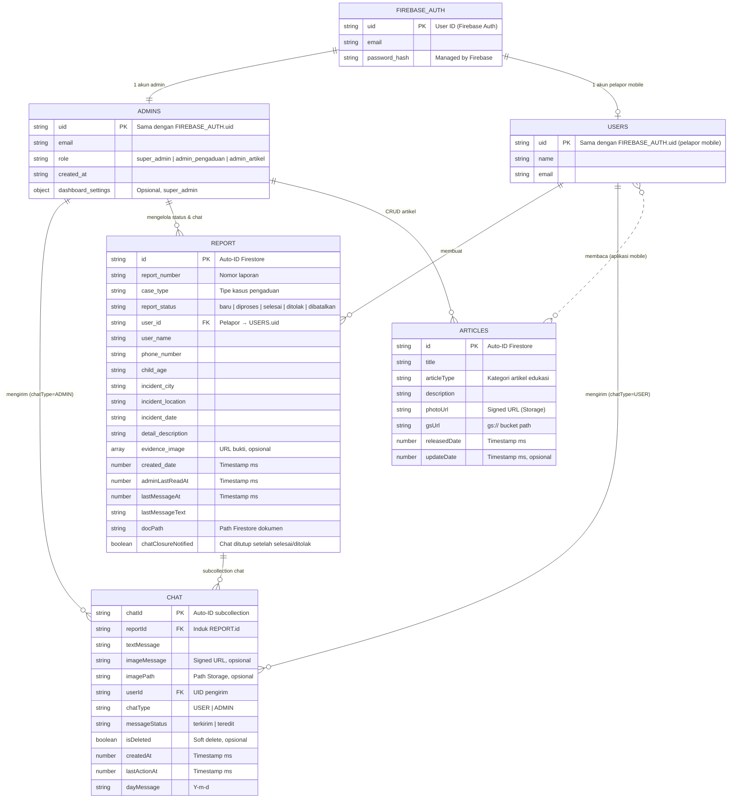
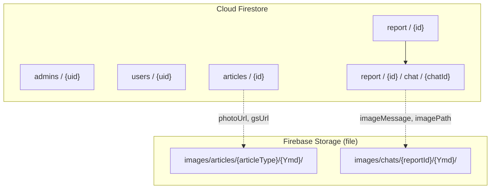
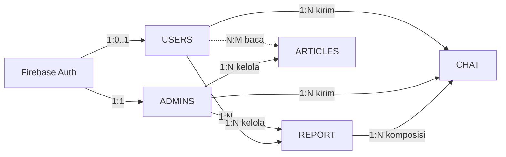

# Entity Relationship Diagram (ERD) — WebsiteAdmin Database

Dokumentasi **ERD** untuk struktur data **NoSQL (Firebase Firestore)** pada aplikasi **WebsiteAdmin** — sistem admin web untuk layanan pengaduan dan edukasi GESA.

> **Catatan:** Aplikasi ini **tidak menggunakan SQL/MySQL**. Semua entitas berikut disimpan di **Cloud Firestore**. Autentikasi admin memakai **Firebase Authentication**; file gambar disimpan di **Firebase Storage** (bukan collection Firestore).

---

## 1. Diagram ERD Utama (Mermaid)

Salin blok kode ke [mermaid.ai](https://mermaid.ai) atau editor Mermaid:

---

## 2. Hierarki Collection Firestore

| Path Firestore | Tipe | Deskripsi |
|----------------|------|-----------|
| `admins/{uid}` | Collection dokumen | Profil & role administrator web |
| `users/{uid}` | Collection dokumen | Profil pengguna/pelapor (aplikasi mobile) |
| `articles/{id}` | Collection dokumen | Artikel edukasi |
| `report/{id}` | Collection dokumen | Laporan pengaduan |
| `report/{id}/chat/{chatId}` | **Subcollection** | Pesan chat per laporan |

---

## 3. Detail Atribut per Entitas

### 3.1 `admins`

| Atribut | Tipe | Wajib | Keterangan |
|---------|------|-------|------------|
| `uid` | string | ✓ | Primary key = UID Firebase Auth |
| `email` | string | ✓ | Email login admin |
| `role` | string | ✓ | `super_admin`, `admin_pengaduan`, `admin_artikel` |
| `created_at` | string/datetime | ✓ | Waktu pembuatan akun admin |
| `dashboard_settings` | object | — | Preferensi dashboard (hanya super admin) |

**Isi `dashboard_settings` (contoh):** `show_stats_*`, `show_chart_*`, `chart_*_type`, `layout_order`, `table_terbaru_limit`.

---

### 3.2 `users`

| Atribut | Tipe | Wajib | Keterangan |
|---------|------|-------|------------|
| `uid` | string | ✓ | Primary key = UID Firebase Auth pelapor |
| `name` | string | — | Nama pengguna |
| `email` | string | — | Email pengguna |

> Collection ini dipakai dashboard untuk menghitung **total pengguna** terdaftar.

---

### 3.3 `articles`

| Atribut | Tipe | Wajib | Keterangan |
|---------|------|-------|------------|
| `id` | string | ✓ | Auto-generated document ID |
| `title` | string | ✓ | Judul artikel |
| `articleType` | string | ✓ | Kategori: `stunting`, `bullying`, `pernikahan dini`, `kekerasan anak` |
| `description` | string | ✓ | Isi/konten artikel (HTML) |
| `photoUrl` | string | ✓ | URL gambar thumbnail (signed URL) |
| `gsUrl` | string | — | Path Google Cloud Storage |
| `releasedDate` | number | ✓ | Tanggal rilis (epoch ms) |
| `updateDate` | number | — | Tanggal update terakhir (epoch ms) |

---

### 3.4 `report`

| Atribut | Tipe | Wajib | Keterangan |
|---------|------|-------|------------|
| `id` | string | ✓ | Auto-generated document ID |
| `report_number` | string | — | Nomor/titel laporan |
| `case_type` | string | ✓ | Tipe kasus pengaduan (8 kategori, lihat §5) |
| `report_status` | string | ✓ | Status penanganan admin |
| `user_id` | string | ✓ | FK logis → `users.uid` |
| `user_name` | string | — | Nama pelapor |
| `phone_number` | string | — | Nomor HP pelapor |
| `child_age` | string | — | Usia korban |
| `incident_city` | string | — | Kota/kabupaten kejadian |
| `incident_location` | string | — | Lokasi detail kejadian |
| `incident_date` | string | — | Tanggal kejadian |
| `detail_description` | string | — | Uraian lengkap pengaduan |
| `evidence_image` | array/string | — | URL foto bukti |
| `created_date` | number | ✓ | Waktu laporan dibuat (epoch ms) |
| `adminLastReadAt` | number | — | Terakhir admin baca chat (ms) |
| `lastMessageAt` | number | — | Timestamp pesan terakhir (ms) |
| `lastMessageText` | string | — | Cuplikan pesan terakhir |
| `docPath` | string | — | Path dokumen Firestore |
| `chatClosureNotified` | boolean | — | `true` setelah pesan penutup selesai/ditolak |

---

### 3.5 `report/{id}/chat` (subcollection)

| Atribut | Tipe | Wajib | Keterangan |
|---------|------|-------|------------|
| `chatId` | string | ✓ | Auto-generated document ID |
| `reportId` | string | ✓ | ID laporan induk |
| `textMessage` | string | — | Isi teks pesan |
| `imageMessage` | string | — | URL gambar lampiran |
| `imagePath` | string | — | Path file di Storage |
| `userId` | string | ✓ | UID pengirim (user atau admin) |
| `chatType` | string | ✓ | `USER` (pelapor) atau `ADMIN` (admin web) |
| `messageStatus` | string | — | `terkirim`, `teredit` |
| `isDeleted` | boolean | — | Penanda soft delete |
| `createdAt` | number | ✓ | Waktu dibuat (epoch ms) |
| `lastActionAt` | number | — | Waktu aksi terakhir (edit/hapus) |
| `dayMessage` | string | — | Tanggal pesan (`Y-m-d`) |

---

## 4. Diagram Relasi Cardinality

| Relasi | Kardinalitas | Jenis | Keterangan |
|--------|--------------|-------|------------|
| Firebase Auth → ADMINS | 1 : 1 | Identifikasi | Setiap admin punya 1 UID Auth + 1 dokumen `admins` |
| Firebase Auth → USERS | 1 : 0..1 | Identifikasi | Pelapor mobile terdaftar di Auth + `users` |
| USERS → REPORT | 1 : N | Asosiasi | Satu pelapor bisa punya banyak laporan |
| REPORT → CHAT | 1 : N | **Komposisi** | Chat hanya ada di dalam laporan; dihapus jika laporan dihapus |
| ADMINS → REPORT | 1 : N | Manajemen | Admin mengubah status, membaca/menutup chat |
| ADMINS → ARTICLES | 1 : N | Manajemen | Super admin & admin artikel kelola artikel |
| USERS → ARTICLES | N : M | Akses baca | Melalui aplikasi mobile (tidak disimpan relasi di Firestore) |

---

## 5. Domain Value (Enum Logis)

### Role admin (`admins.role`)

| Nilai | Akses web admin |
|-------|-----------------|
| `super_admin` | Dashboard, artikel, pengaduan (read-only chat), pengaturan admin |
| `admin_pengaduan` | Dashboard, pengaduan & chat |
| `admin_artikel` | Artikel edukasi |

### Tipe kasus pengaduan (`report.case_type`)

| Nilai |
|-------|
| Eksploitasi Anak |
| Kekerasan Fisik |
| Kekerasan Psikis |
| Kekerasan Seksual |
| Penelantaran Anak |
| Perdagangan Anak |
| Perundungan |
| Yang lain |

### Status laporan (`report.report_status`)

| Nilai | Makna |
|-------|-------|
| `baru` / belum ditangani | Laporan baru masuk |
| `diproses` | Sedang ditangani |
| `selesai` | Selesai — chat ditutup |
| `ditolak` | Ditolak admin — chat ditutup |
| `dibatalkan` | Dibatalkan pelapor — chat ditutup |

### Tipe pengirim chat (`chat.chatType`)

| Nilai | Pengirim |
|-------|----------|
| `USER` | Pelapor (aplikasi mobile) |
| `ADMIN` | Admin pengaduan (web) |

### Kategori artikel (`articles.articleType`)

| Nilai |
|-------|
| `stunting` |
| `bullying` |
| `pernikahan dini` |
| `kekerasan anak` |

---

## 6. Firebase Storage (Referensi File)

Bukan entitas Firestore, tetapi terkait atribut URL/path:

| Path Storage | Dipakai oleh | Atribut Firestore |
|--------------|--------------|-------------------|
| `images/articles/{articleType}/{Ymd}/{file}` | ARTICLES | `photoUrl`, `gsUrl` |
| `images/chats/{reportId}/{Ymd}/{file}` | CHAT | `imageMessage`, `imagePath` |

---

## 7. Referensi Implementasi

| Entitas / Operasi | File controller utama |
|-------------------|------------------------|
| Login & Auth | `app/Http/Controllers/authcontroller.php` |
| CRUD artikel | `app/Http/Controllers/articlecontroller.php` |
| CRUD laporan & chat | `app/Http/Controllers/laporancontroller.php` |
| Manajemen admin | `app/Http/Controllers/pengaturancontroller.php` |
| Agregasi dashboard | `app/Http/Controllers/dashboardcontroller.php` |
| Profil admin | `app/Http/Controllers/ProfileController.php` |

---

## 8. Catatan Desain NoSQL

1. **Tidak ada JOIN SQL** — relasi `user_id`, `reportId` bersifat **logis**; aplikasi Laravel membaca dokumen terpisah lalu menggabungkan di PHP.
2. **Subcollection `chat`** — relasi kuat (composition) dengan `report`; path: `report/{reportId}/chat/{chatId}`.
3. **Timestamp** — sebagian besar field waktu disimpan sebagai **number (milliseconds since epoch)**.
4. **Session web** — setelah login, data admin (`uid`, `email`, `role`) disimpan di **session Laravel**, bukan di Firestore.
5. **Cache** — aplikasi memakai `Cache::remember` untuk laporan, artikel, dan dashboard agar mengurangi baca Firestore.
